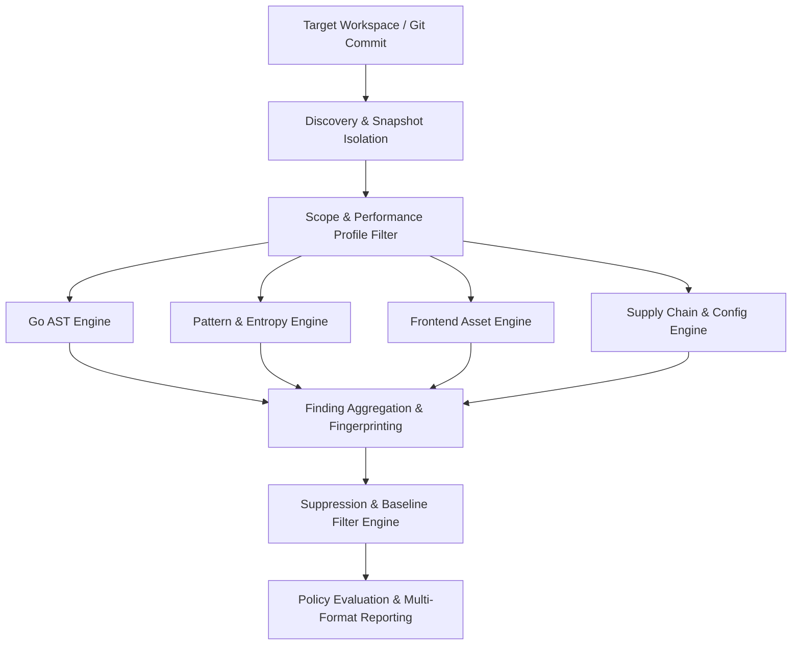

# How It Works & Reproducing Findings

This page explains the internal analysis mechanics of `go-code-scanner` (`security-review`) and provides a structured playbook for developers and security analysts to reproduce, diagnose, and verify security findings.

---

## Group 1: Scanner Mechanics & Architecture (Cara Kerja Scanner)

`go-code-scanner` operates as an offline-first, policy-driven static analysis security tool (SAST). Its execution pipeline transforms raw source code into structured, actionable security reports through a deterministic multi-stage analysis process.



### 1.1 Scan Pipeline Stages

1. **Target Discovery & Snapshot Isolation**:
   - Analyzes project workspace files based on active mode (full scan by default, `--changed`, or `--staged`).
   - In `--staged` mode, materializes temporary snapshots directly from the `git index` objects to guarantee that unstaged edits never introduce noise.
2. **Scope & Profile Filtering**:
   - Filters target files according to scope (`all`, `server`, `client`) and active rulesets determined by performance profile (`fast`, `standard`, `full`, `frontend`).
3. **Multi-Engine Execution**:
   - Concurrently executes detection engines tailored to specific source code languages and asset types.
4. **Finding Aggregation & Fingerprinting**:
   - Standardizes raw violations into structured findings with deterministic fingerprints.
5. **Suppression & Baseline Filtering**:
   - Evaluates findings against inline `// nolint` comments, `.security-ignore`, and `.security-baseline.json`.
6. **Policy Threshold Evaluation & Reporting**:
   - Compares remaining findings against `--fail-on` severity thresholds and generates requested report formats (Terminal, JSON, SARIF, JUnit).

---

### 1.2 Detection Engine Matrix

`security-review` employs four specialized detection engines:

| Engine | Target Assets | Analysis Technique | Common Violations Detected |
| :--- | :--- | :--- | :--- |
| **Go AST Engine** | `*.go` source files | Abstract Syntax Tree (`go/ast`) parsing, node traversal, call graph inspection | Unhandled errors, SQL injection sinks, weak crypto (`md5`/`sha1`), unsafe concurrency |
| **Pattern & Entropy Engine** | All text files | High-entropy string scoring, tuned regex patterns, context windowing | Hardcoded API keys, JWT secrets, private keys, database credentials |
| **Frontend Asset Engine** | `*.jsx`, `*.tsx`, `*.vue`, `*.svelte` | Abstract Syntax Tree & template structure inspection | `dangerouslySetInnerHTML`, DOM XSS sinks, client-side secret exposure |
| **Supply Chain Engine** | `go.mod`, `go.sum`, configuration JSON/YAML | Dependency version analysis, governance policy enforcement | Vulnerable dependencies, weak TLS configurations, unauthorized licenses |

---

### 1.3 Evaluation Logic & Fingerprint Calculation

To ensure reliable issue tracking across commits and refactorings, every finding receives a deterministic **Fingerprint**.

```
Fingerprint = SHA-256( Rule_ID + "|" + Relative_File_Path + "|" + Normalized_Code_Snippet )
```

- **Persistence**: Renaming unrelated functions or changing line offsets above/below a finding will not alter its fingerprint, preventing duplicate alerts in CI/CD.
- **Context Normalization**: Strips variable whitespace while preserving essential syntax context to avoid fingerprint churn.

---

## Group 2: Step-by-Step Finding Reproduction Playbook (Metode Reproduksi Finding)

When `security-review` reports a security finding in CI or local CLI execution, follow this 6-step reproduction playbook to isolate, diagnose, and verify the issue.

### Step 1: Extract Finding Context

Gather key metadata from your terminal scan output or JSON report:

```json
{
  "id": "SEC-GO-0042",
  "rule_id": "go-shell-command",
  "severity": "HIGH",
  "file": "pkg/runner/exec.go",
  "line": 45,
  "fingerprint": "a3f89b12e...",
  "message": "Unsanitized user input passed to os/exec.Command"
}
```

Required fields for reproduction:
- **`rule_id`**: The rule that triggered (`go-shell-command`).
- **`file` & `line`**: Target file location (`pkg/runner/exec.go:45`).
- **`fingerprint`**: Unique finding ID.

---

### Step 2: Run Targeted Isolated Scan

Isolate the scan execution to the target root directory or file path. This eliminates noise from unrelated repository files and speeds up analysis:

```sh
# Run targeted scan on single path with verbose output
security-review scan --root pkg/runner/exec.go --verbose
```

::: tip JSON Output Inspection
Export to JSON format to inspect exact match context and raw engine metadata:
```sh
security-review scan --root pkg/runner/exec.go --format json
```
:::

---

### Step 3: Inspect Rule Rationale & Diagnostics

To understand why the engine flagged the code and how to remediate it, use the `--explain` flag:

```sh
security-review scan --explain go-shell-command
```

Output includes:
- Security risk description & CWE reference.
- Vulnerable vs. Secure code examples.
- Remediation guidance.

Use the `--verbose` flag during scan execution to observe internal engine AST node evaluations:
```sh
security-review scan --root pkg/runner/exec.go --verbose
```

---

### Step 4: Verify Baseline & Suppression Constraints

Determine if the finding is active, suppressed, or baseline-filtered:

1. **Test Raw Scan (Without Baseline)**:
   ```sh
   # Run scan without baseline file to verify raw detection
   security-review scan --root pkg/runner/exec.go
   ```
2. **Check Inline Annotations**:
   Inspect if `// nolint:go-shell-command` exists on or above the target line.
3. **Check Suppression File**:
   Verify if the finding fingerprint or file path is matched in `.security-ignore`.

---

### Step 5: Construct Minimal Reproducible Example (MRE)

To confirm whether a finding is a **True Positive (TP)** or a **False Positive (FP)**, isolate the trigger pattern in a minimal test fixture:

```go
// testdata/repro_command_injection.go
package testdata

import "os/exec"

func Repro(userInput string) {
    // Should trigger go-shell-command
    exec.Command("sh", "-c", userInput)
}
```

Scan the MRE file:
```sh
security-review scan --root testdata/repro_command_injection.go
```

- If the MRE triggers as expected: **Confirmed True Positive**.
- If code is safe but flagged: **False Positive**. Document the pattern and request rule refinement or add a formal suppression.

---

### Step 6: Remediation & Fix Verification

Apply the recommended remediation to the source code:

```diff
- exec.Command("sh", "-c", userInput)
+ exec.Command("ls", "-l", safeFileName)
```

Re-run the targeted scan to verify finding resolution:

```sh
security-review scan --root pkg/runner/exec.go
```

::: success Verification Criteria
Reproduction is successful when:
1. Scanner reports **0 findings** (`No security findings detected`).
2. Scan exit code is `0`.
:::
