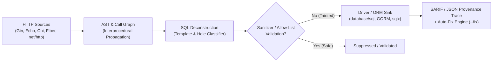

# AST & SQL Taint Analysis Subsystem

`security-review` includes a native, offline-capable **AST (Abstract Syntax Tree) & SQL Taint Analysis Engine** (`sqltaint`). Unlike naive regex pattern matchers that only look for keyword patterns, the `sqltaint` engine inspects Go AST syntax trees, models interprocedural parameter passing, reconstructs dynamic SQL templates, and tracks dataflow provenance from untrusted user inputs directly into database driver sinks.

---

## Architecture & How It Works

The taint analysis pipeline operates across 5 discrete static analysis phases:



### 1. HTTP Router Source Discovery
The engine automatically discovers untrusted entry points by modeling popular Go HTTP frameworks and standard library handlers:
- **`gin-gonic/gin`**: `c.Param()`, `c.Query()`, `c.PostForm()`, `c.GetHeader()`, `c.ShouldBindJSON()`
- **`labstack/echo`**: `c.Param()`, `c.QueryParam()`, `c.FormValue()`, `c.Bind()`
- **`go-chi/chi`**: `chi.URLParam()`, `r.URL.Query()`
- **`gofiber/fiber`**: `c.Params()`, `c.Query()`, `c.Body()`
- **`gorilla/mux`**: `mux.Vars(r)`
- **`net/http`**: `r.URL.Query()`, `r.FormValue()`, `r.Header.Get()`

### 2. Interprocedural Dataflow & Call Graph
Rather than limiting analysis to a single function body (*intraprocedural*), `sqltaint` constructs a workspace-wide symbol table and call graph. If an HTTP handler receives an untrusted `userID` and passes it through helper functions or domain repositories, the engine propagates the taint mark across function boundaries down to the final database query.

### 3. SQL Template & Hole Classification
When dynamic strings or format expressions (`fmt.Sprintf`, `+`, `strings.Join`) reach a query sink, the engine deconstructs the SQL query into constant tokens and dynamic **Holes**:
- **`HoleContextValue`**: Dynamic string inserted where a SQL literal/parameter value belongs (e.g. `WHERE id = '...'`). Requires parameterized placeholders (`?` or `$1`).
- **`HoleContextIdentifier`**: Dynamic string inserted where a table name, column name, or sort direction belongs (e.g. `ORDER BY ...`). Requires strict allow-list validation.
- **`HoleContextListExpansion`**: Slices or arrays joined with commas (e.g. `IN (...)`). Requires safe slice binding such as `sqlx.In`.

### 4. Dataflow Tracing & SARIF Provenance
Every detected vulnerability includes an end-to-end dataflow trace (`Source` → `Propagator` → `Sink`). These traces are serialized in CLI output, JSON reports, and standard SARIF format for GitHub Code Scanning and IDE extensions.

---

## Automated Remediation Engine (`--fix`)

The `sqltaint` engine includes an automated AST rewriter. When invoked with `security-review scan --fix`, it safely rewrites unsafe string concatenations into parameterized SQL queries without breaking code semantics.

### AST Rewriting Transformation Example

::: code-group
```go [Before (Unsafe Concatenation)]
// Handler with dynamic string concatenation
func getUser(db *sql.DB, id string) (*sql.Row, error) {
    query := "SELECT id, name FROM users WHERE id = " + id
    return db.QueryRow(query), nil
}
```

```go [After (Automated AST Fix)]
// Automatically rewritten with parameterized placeholder and argument injection
func getUser(db *sql.DB, id string) (*sql.Row, error) {
    query := "SELECT id, name FROM users WHERE id = $1"
    return db.QueryRow(query, id), nil
}
```
:::

---

## Database & SQL Rule Matrix

Detailed descriptions, threat models, remediation steps, and **Do's and Don'ts** code examples for all SQL and database rules are centrally documented in the [Rule Catalog](/reference/rules).

### 1. SQL Injection & Taint Propagation

| Rule ID | Severity | Category | Focus Area | Details & Examples |
| :--- | :---: | :--- | :--- | :---: |
| [`SQLI-001`](/reference/rules#sqli-001) | `HIGH` | `sql-injection` | Untrusted value concatenated or formatted into executable SQL sink | [View Guidance](/reference/rules#sqli-001) |
| [`SQLI-002`](/reference/rules#sqli-002) | `HIGH` | `sql-injection` | Dynamic table name, column, or identifier interpolation | [View Guidance](/reference/rules#sqli-002) |
| [`SQLI-004`](/reference/rules#sqli-004) | `HIGH` | `orm-escape-hatch` | Unsafe raw ORM query methods (`db.Raw()`, `db.Where()`) | [View Guidance](/reference/rules#sqli-004) |
| [`SQLI-008`](/reference/rules#sqli-008) | `MEDIUM` | `bind-mismatch` | SQL bind placeholder count does not match argument count | [View Guidance](/reference/rules#sqli-008) |
| [`SQLI-011`](/reference/rules#sqli-011) | `HIGH` | `list-expansion` | Unsafe `IN (...)` clause slice joining via `strings.Join` | [View Guidance](/reference/rules#sqli-011) |
| [`SQLI-012`](/reference/rules#sqli-012) | `HIGH` | `prepared-statement` | Tainted dynamic SQL template passed into `db.Prepare()` | [View Guidance](/reference/rules#sqli-012) |
| [`sql-string-format`](/reference/rules#sql-string-format) | `HIGH` | `injection` | SQL query constructed using `fmt.Sprintf` or string formatting | [View Guidance](/reference/rules#sql-string-format) |
| [`dynamic-order`](/reference/rules#dynamic-order) | `HIGH` | `injection` | Dynamic `ORDER BY` clause constructed via string interpolation | [View Guidance](/reference/rules#dynamic-order) |

### 2. Multi-Tenant Isolation & Authorization

| Rule ID | Severity | Category | Focus Area | Details & Examples |
| :--- | :---: | :--- | :--- | :---: |
| [`SQLAUTH-001`](/reference/rules#sqlauth-001) | `HIGH` | `multi-tenant-isolation` | Multi-tenant entity queried without `tenant_id`/`org_id` scoping | [View Guidance](/reference/rules#sqlauth-001) |
| [`SQLAUTH-002`](/reference/rules#sqlauth-002) | `HIGH` | `authorization-idor` | Direct object reference lookup without owner context check (IDOR) | [View Guidance](/reference/rules#sqlauth-002) |
| [`SQLAUTH-003`](/reference/rules#sqlauth-003) | `HIGH` | `raw-query-bypass` | Raw query bypasses standard ORM authorization scopes | [View Guidance](/reference/rules#sqlauth-003) |
| [`SQLAUTH-004`](/reference/rules#sqlauth-004) | `HIGH` | `rls-misconfiguration` | Database query switches to superuser or bypasses Row-Level Security | [View Guidance](/reference/rules#sqlauth-004) |

### 3. Data Safety, Concurrency & Logic Integrity

| Rule ID | Severity | Category | Focus Area | Details & Examples |
| :--- | :---: | :--- | :--- | :---: |
| [`SQLSAFE-001`](/reference/rules#sqlsafe-001) | `HIGH` | `destructive-query` | Unbounded `UPDATE` or `DELETE` statement without a `WHERE` clause | [View Guidance](/reference/rules#sqlsafe-001) |
| [`SQLSAFE-003`](/reference/rules#sqlsafe-003) | `HIGH` | `concurrency-hazard` | Read-modify-write concurrency hazard without row locking (`FOR UPDATE`) | [View Guidance](/reference/rules#sqlsafe-003) |
| [`SQLSAFE-004`](/reference/rules#sqlsafe-004) | `HIGH` | `transaction-loss` | Database operation executes on global pool escaping active transaction | [View Guidance](/reference/rules#sqlsafe-004) |
| [`SQLSAFE-005`](/reference/rules#sqlsafe-005) | `HIGH` | `logic-operator-precedence` | Unparenthesized mixed `AND` / `OR` operator precedence hazard | [View Guidance](/reference/rules#sqlsafe-005) |
| [`SQLSAFE-006`](/reference/rules#sqlsafe-006) | `MEDIUM` | `soft-delete-bypass` | Raw query omits `deleted_at IS NULL` on soft-deletable entity | [View Guidance](/reference/rules#sqlsafe-006) |

### 4. Performance, Observability & Migration Hygiene

| Rule ID | Severity | Category | Focus Area | Details & Examples |
| :--- | :---: | :--- | :--- | :---: |
| [`DBPERF-001`](/reference/rules#dbperf-001) | `MEDIUM` | `query-performance` | Public dataset queried without an explicit `LIMIT` or pagination | [View Guidance](/reference/rules#dbperf-001) |
| [`DBPERF-002`](/reference/rules#dbperf-002) | `HIGH` | `n-plus-one` | Database query executed inside loop (N+1 query anti-pattern) | [View Guidance](/reference/rules#dbperf-002) |
| [`DBSEC-002`](/reference/rules#dbsec-002) | `HIGH` | `data_leak` | Sensitive credentials or PII fields logged to database tracing stream | [View Guidance](/reference/rules#dbsec-002) |
| [`DBSEC-003`](/reference/rules#dbsec-003) | `HIGH` | `information_exposure` | Internal database driver error exposed directly to HTTP client | [View Guidance](/reference/rules#dbsec-003) |
| [`DBMIG-001`](/reference/rules#dbmig-001) | `HIGH` | `destructive-migration` | Immediate destructive column/table drop without phased rollout | [View Guidance](/reference/rules#dbmig-001) |
| [`DBMIG-002`](/reference/rules#dbmig-002) | `MEDIUM` | `migration-safety` | Database migration file lacks reversible rollback instructions | [View Guidance](/reference/rules#dbmig-002) |
| [`DBMIG-003`](/reference/rules#dbmig-003) | `MEDIUM` | `schema-integrity` | Security-sensitive key column defined without encryption/hashing | [View Guidance](/reference/rules#dbmig-003) |

---

## Multi-Language Framework Models

In addition to deep Go AST analysis, `security-review` includes static models for major database drivers and ORMs across **Node.js/TypeScript**, **Python**, and **Java/Kotlin**:

| Ecosystem | Framework / Driver | Rule ID | Description | Details |
| :--- | :--- | :--- | :--- | :---: |
| **Node.js / TS** | Prisma ORM | [`node-prisma-raw-query`](/reference/rules#node-prisma-raw-query) | Dynamic `$queryRawUnsafe` / `$executeRawUnsafe` | [View Rule](/reference/rules#node-prisma-raw-query) |
| **Node.js / TS** | TypeORM | [`node-typeorm-raw-query`](/reference/rules#node-typeorm-raw-query) | Raw `query()` with string template interpolation | [View Rule](/reference/rules#node-typeorm-raw-query) |
| **Node.js / TS** | Sequelize | [`node-sequelize-raw-query`](/reference/rules#node-sequelize-raw-query) | `sequelize.query()` with string template interpolation | [View Rule](/reference/rules#node-sequelize-raw-query) |
| **Node.js / TS** | node-postgres (`pg`) | [`node-pg-dynamic-query`](/reference/rules#node-pg-dynamic-query) | Dynamic `client.query()` without parameter arrays | [View Rule](/reference/rules#node-pg-dynamic-query) |
| **Node.js / TS** | `mysql2` | [`node-mysql-dynamic-query`](/reference/rules#node-mysql-dynamic-query) | Dynamic `pool.query()` without placeholder bindings | [View Rule](/reference/rules#node-mysql-dynamic-query) |
| **Python** | SQLAlchemy | [`python-sqlalchemy-raw-sql`](/reference/rules#python-sqlalchemy-raw-sql) | `text()` expressions formatted with Python f-strings | [View Rule](/reference/rules#python-sqlalchemy-raw-sql) |
| **Python** | Django ORM | [`python-django-raw-sql`](/reference/rules#python-django-raw-sql) | Unsafe `raw(f"...")` or `.extra()` clauses | [View Rule](/reference/rules#python-django-raw-sql) |
| **Python** | `psycopg2` / `psycopg3` | [`python-psycopg-format-query`](/reference/rules#python-psycopg-format-query) | `cursor.execute()` formatted via `%` or f-strings | [View Rule](/reference/rules#python-psycopg-format-query) |
| **Java / Kotlin** | Spring Data JPA | [`java-spring-jpa-native-query`](/reference/rules#java-spring-jpa-native-query) | Concatenated native `@Query(nativeQuery = true)` | [View Rule](/reference/rules#java-spring-jpa-native-query) |
| **Java / Kotlin** | Hibernate | [`java-hibernate-native-query`](/reference/rules#java-hibernate-native-query) | Concatenated `session.createNativeQuery()` | [View Rule](/reference/rules#java-hibernate-native-query) |
| **Java / Kotlin** | Spring JdbcTemplate | [`java-jdbc-dynamic-query`](/reference/rules#java-jdbc-dynamic-query) | Concatenated `jdbcTemplate.query()` | [View Rule](/reference/rules#java-jdbc-dynamic-query) |

---

## Enabling in Configuration

To explicitly configure the `sqltaint` scanner in your `security-review.json` file:

```json
{
  "version": 1,
  "scanners": {
    "sqltaint": {
      "enabled": true,
      "required": false
    }
  }
}
```

### CLI Execution Options

Run taint analysis standalone or across all scanners:

::: code-group
```bash [Full Workspace Scan]
security-review scan --mode=full
```

```bash [Targeted SQL Taint Scan]
security-review scan --scanners=sqltaint
```

```bash [Scan with Auto-Remediation]
security-review scan --scanners=sqltaint --fix
```
:::
